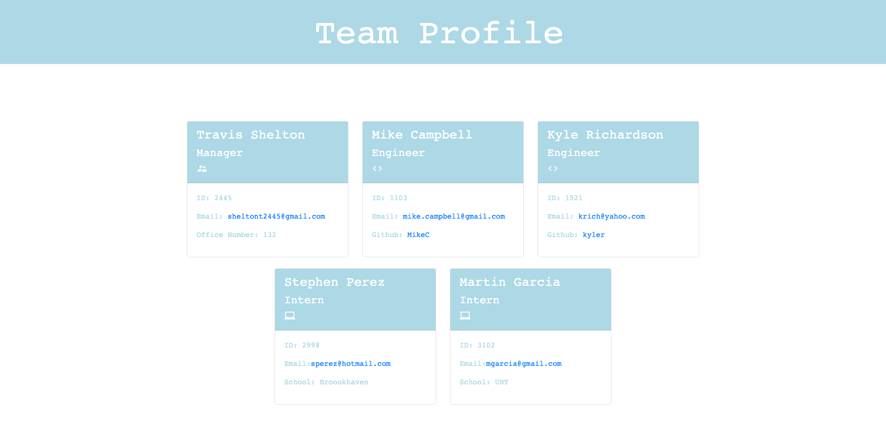

# Team Profile Generator 

## Description 
This is a Node.js command-line application that takes in information about employees and generates an HTML webpage that displays summaries for each person utilizing OOP and TDD with Jest. 

## Table of Contents
* [Installation](#installation)
* [Usage](#usage)
* [License](#license)
* [Tests](#tests)
* [Demo](#demo)
* [Screenshot](#screenshot)

## Installation 
Clone or download the project and install node. In order to use the Test functionality you must install Jest using `npm i jest`.

## Usage 
Type `node index.js` into the command line and answer the inquirer prompts.

## License 
This project is license under MIT

## Tests
Run `npm test` to run Jest for tests on constructors.

## Demo
What a quick Demo https://youtu.be/Jyf9RzogIHo

## Screenshot
